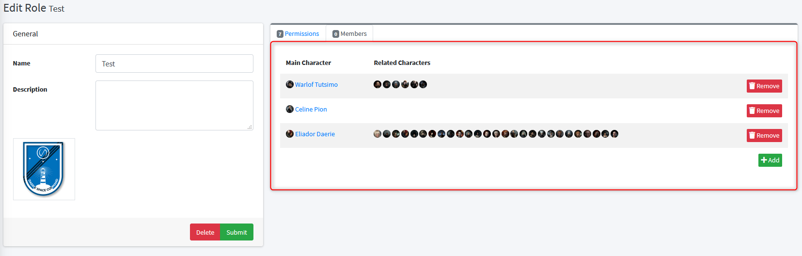

# Role-Based Access Control

## Introduction
SeAT supports configuring user access control by means of [Role-based Access Control] (RBAC).
This allows for SeAT administrators to granularly control who has access to what based on which roles a SeAT user has.

In SeAT, the default rule is to deny access. As a result, someone without a permission will not be able to access the requested resource.

!!! tip
    Use roles to define permission without wondering about automation. You will be able to set up role auto assignment with [Squads].
    The more granular are your roles, the easier they will be to maintain them and built your automation rules.

## Definitions
This section aims to clear up the definitions used in the SeAT RBAC implementation.

* **User**  
A SeAT user account. This can be either a user account that was created in SeAT itself, or an automatically created account based on SSO.
The only difference between the accounts is that with an SSO account, SeAT has no idea what the account's password is.
Otherwise, everything else is exactly the same.

* **Scope**
A scope is a domain grouping different permissions related to the same topic. Permissions from certain scope can be limited (ie: character or corporation).

* **Permission**  
A Permission is an attribute that is assigned to a *Role*. It grants access based on the specific permission.

* **Role**  
A Role is simply a collection of permissions. Users get assigned a roles and inherit the permissions granted by that role.
A user cannot be given a raw permission. Permissions can only be granted by creating a Role, assigning permissions to the Role and granting the role to a user.

* **Filters**
Permissions from certain scope can received filters. That simply mean the granted permission is limited to certain conditions.
As an example, you may want to limit the asset permission from character scope to only a selection of character.

* **Entity**  
An entity is something on which the permission will be applied. It can be a Character, a Corporation or anything else.

## Interface

To manage roles, you must go into Settings from SeAT sidebar, then choose Access Management.

!!! info
    To be able to manage SeAT roles, you must be authenticated as an administrator user.
    Administrators can be managed in the users list, located in Settings.

### Role card

The Role card is compounds of two main area.

Left pane contains basic information. It allows you to provide a name, a description and upload an optional logo.
Those information can be sync with any third party platform using the API.

!!! tip
    Provided logo are stored into database - so you don't need to worry when moving your installation.

Right pane contains role settings. The pane is split in two tabs - first tab is showing the role permissions definitions.
Second pane, the members one, gives you the current role members and related management actions.

### Role definition

#### Role permissions

The role permissions tab is built using a navigation bar, which is showing all available scopes - and the list of permissions from active scope.
Use the scope navigation to show permissions related to each scope.

Each permission block is structured as follow:
- a checkbox: if you check it, you mark the permission to be granted by the role
- an optional icon: it is visual only and help to pair some permission inside a same scope. It might be useful for large scope like character or corporation to distinguish permission kind.
- an user friendly name
- an optional description: this is mostly a text explaining the permission purpose
- an optional filters button: it will help you to restrict the permission area to only a certain population. Only character and corporation scope permissions can be filtered.

#### Role members

The role members tab is a table listing all users who are currently inside the role. All of them benefits of permissions which have been defined in the permissions tab from that same role.
You will be able to add or remove any user to or from the role using action buttons.

To remove an user from the role to which is part, simply click on the "Remove" button located on the member line.

To add one or multiple user to the role, use the green "Add" button located at bottom right corner. This will show you a dialog box. Use the drop-down control to find users which you want to add.
Once all users to be add have been choose, click on the "Close" button located at bottom right corner from that modal. Selected users will be shown with a warning background.
This mean selection isn't saved yet - you have to apply change using the green "Submit" button located under the General pane.

[Role-based Access Control]: https://en.wikipedia.org/wiki/Role-based_access_control
[Squads]: #
