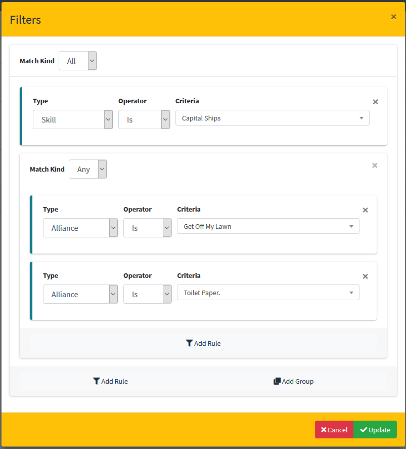
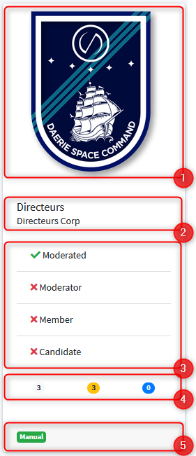
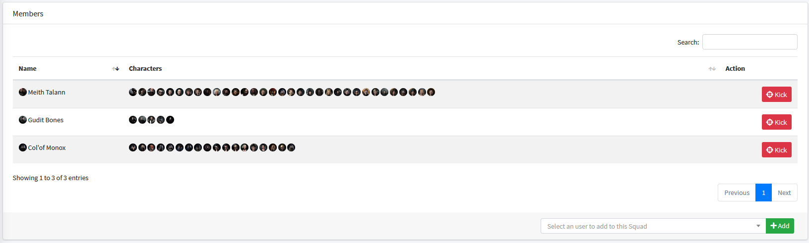
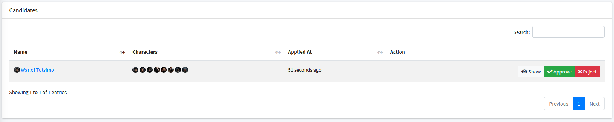
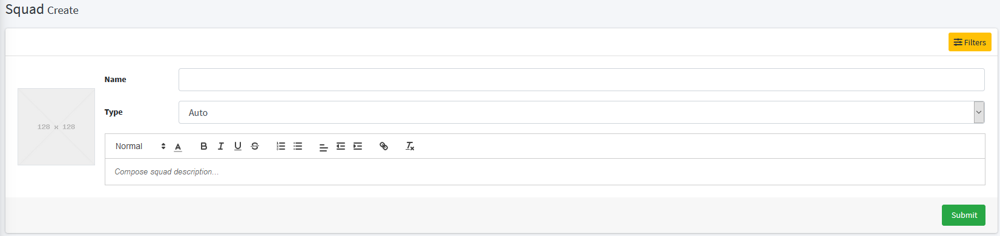

# Squads

## Introduction

Since SeAT 4.0, there is a way to apply automatic logic between an end user and its roles.
The purpose is to keep distinct the security and automations.

Squads is the core implementation of the deprecated seat-groups plugin.

## Squads Types

There are multiple kinds of squad. The way they work and the automations they apply depend on their type.

### Automatic

This is the simplest squad.
When you define an automatic squad, all end user which meet the squad filters will be attached to it automatically.

An user who's part of an automatic squad cannot leave it by himself.
If for some reason, an user beeing part of a squad was non longer meeting the squad filter - he will be automatically kicked from it.

### Manual

Manual squads need end user action, called an application.
Then flow of manual squad depends on it's is being moderated or not.

In case the squad is not moderated, the end user will become a member of that squad as soon as he applied to it.
Otherwise, his application will need a review.

Reviews can be done by any moderator of a squad, at any time.

### Hidden

Hidden squads are visible by its member and admin users only.
To be part of an hidden squad, an user need to be added to it by an admin user.

This mean, only admin user can invite another user to an hidden squad.

## Squads Filters

Filters have different behaviors depending on the Squad Type on which they have been set.
In case the Squad is of auto type, filters will be applied continuously to invite and kick members from the Squad - based on user changes.

Otherwise, filters are used to automatically kick members from a Squad and determine the availability of the "Apply" button on Squad Card.

Squads Filters have been designed to assist you to build rules which will determine whether an user can be part of a Squad.
You pair different conditions together and link them with match keywords.

Match keywords can be either `All` or `Any`.
`All` mean all conditions must be met by the user to be part of the Squad.
`Any` mean any of the listed condition can be met.

To add a condition, use `Add Rule` button located at the end of the modal.
In case you have to build a complex rule, use `Add Group` which will allow you to pair multiple condition in a single one.

!!! example
    In the example upper, we want only users who own at least one character (inside either **Get Off My Lawn** OR **Toilet Paper.** alliances) AND with skill **Capital Ships** been eligible to our Squad.

## Squads Applications

Applications are only available to manual squads.

When an user want to apply to a manual squad, he needs to meet the squad filters.
Otherwise, application button will not be available to him.

If the user submit to a moderated squad, he will have to fill an application form.
This will leave you the ability to build workflow internally and allow moderators to check any incoming members.
Users can also cancel squad applications at any time using the Cancel button which will replace the Join button.

## Squads Moderators

Moderators of a Squad don't need to be part of that squad.
They will be able to see a list of every member of each squad they moderate, allowing them to invite further members or kick existing ones.

Squad moderators can also see Squad candidates, the time when they applied and each application form.
From there, they can approve an application or reject it.

When an application is approved, the user who sent it is becomes a member of the Squad.
If an application is denied, the application is removed and user can submit a new application.

Only administrator users can add or remove moderators to/from a Squad.

## Interface

### Squads List

Squads list is the entry point of squads. You can create a new squad, search for a squad, show available squads and get squad status from there.
The Squads list is available to all users, without any restriction. You can access it using `Squads` from the left sidebar.

The list is split in three main areas.
First area, at top, contains controls which will allow you to make filters and/or create squad.
The main area, contains squads tiles from the active page. You can get up to six squads per page.
Footer area is the pagination controls - allowing you to switch displayed page (first, previous, current, next and last).

Every Squad Tile is built following the same pattern :
1) Logo
2) Name and description
3) User status related to that squad
4) Metadata
5) Type

Except metadata, other attributes are self-explained. Metadata is a list of counters showing you, from left to right :
- members amount of that squad (in white)
- moderators amount in that squad (in orange)
- applications amount in the squad (in blue)

!!! hint
    Squad Logo is a visual way for your end user to identify quickly a Squad.
    By default, logo are generated based on the Squad Name - but you can customise it in the Squad settings.

### Squads Card

When you click on a Squad Tile, you'll land on the related Squad Card. Squad Card is the leaving area of a Squad.
You will retrieve summarised information you had on the tile in the general pane.

In case the Squad is manual, you will get access to the list of Squad moderators.
This list is public, this mean everyone can see it, without consideration if he's or not a member of that Squad.

Under the general pane, you'll get access to the list of roles assigned by the Squad.
This list is disclosed to admin user only. This mean neither "standard user" or moderators will get access to it.

From that pane, you are able to remove a role from the squad or add other ones to it.

Members pane is visible to all moderators and squad members.
Moderators can invite or kick user from the squad using actions buttons.

!!! info
    When an user is kicked or invited from/to a Squad, the event is shown into security logs.
    You will be able to see who kick or invite any user from/to any Squad.

Last but not least, there is an extra Candidates pane which is available on Manual Moderated Squad.
Squad applications can be managed from this area.

### Squads Settings

When you create a new Squad, you have to fill a small form which will define it. Mandatory elements are :

- The name of created squad which have to be unique
- Squad Type (between Auto, Hidden and Manual - see [Squads Types](#squads-types]))
- A description, which will be displayed on both Squad Card and Squad Tile

You also can upload a shiny logo which will be used instead the generated icon and provide filters.

!!! caution
    As soon as you're saving your Squad, filters are applied.
    In case the Squad is of auto type, eligible members will be added to it.
    For any other Squad Types, non-eligible members will be kicked from the Squad

!!! hint
    Don't pay attention to your Squads Description. If it's too long, it will be shortened when displayed on the Squad Tile.
    However, the full description will always been available on the Squad Card into the general pane.
