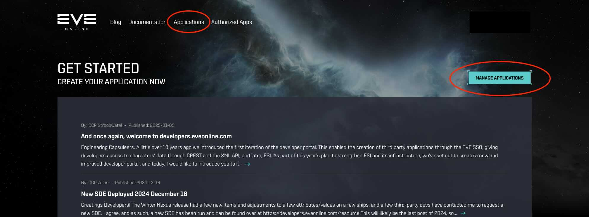
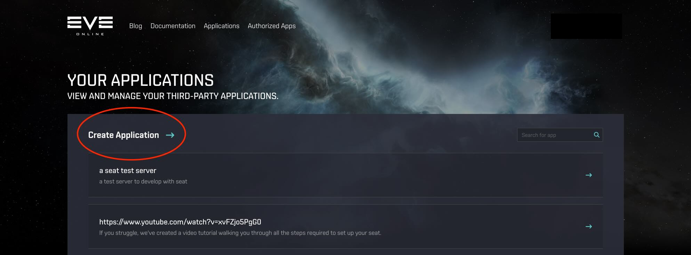
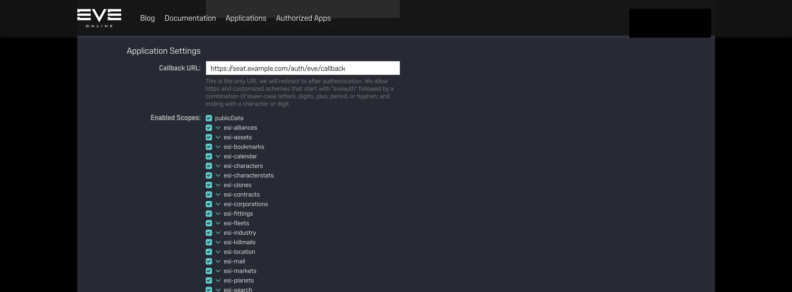
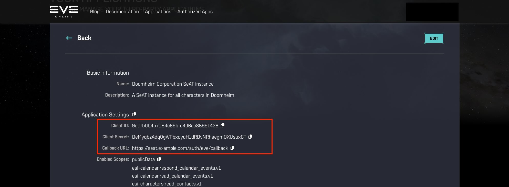

# Configuring Eve Online ESI-Scopes

## Introduction

For normal operations within SeAT, authentication is provided by EVE Onlines' SSO service and API access with ESI and tokens supplied via SSO. Technical details behind the SSO implementation can be found [here](https://eveonline-third-party-documentation.readthedocs.io/en/latest/sso/index.html).

Authenticating users using SSO effectively means that users may authenticate to SeAT using their existing EVE Online credentials. SeAT *does not* have access to the credentials itself as that is handled entirely by CCP. Only once authentication is successful from an EVE Online perspective does a user get asked if they want to allow your SeAT installation to have access with the configured set of scopes. Once the user agrees to these scopes, the users browser is redirect back to SeAT and will be logged in.

If you have not configured this yet, the login page will present you with a warning about it:


## Configuration Summary

A bit of setup work is needed in order to have your SeAT setup ready for SSO integration and ESI usage. The gist of it is:

- [Step I](#register-your-application): Register your application on the [EVE Online Developers portal] for both Authentication and API Access.
- [Step II](#set-config-parameters-in-env-file): Configure your `EVE_CLIENT_ID`, `EVE_CLIENT_SECRET` and `EVE_CALLBACK_URL` in the `.env` configuration [file]

## Register your application

Browse to the [EVE Online Developers portal] and open the application management page. You might be asked to log in with your EVE account.



Create a new application.



Give your application a **meaningful** *Name* and a *Description*. Users will see this name when they review the access Third Party applications have to their account so keep that in mind when registering your application.


Next, specify the *Callback URL* and select the *ESI Scopes* you want (probably all of them).

You can also expand scope categories to configure each scope individually.



!!! note "Note on the Callback URL"

    The Callback URL where the user should be redirected to once authentication was successful. In other words, once they have completed authentication using their EVE Online credentials, they need to be redirected back to your SeAT instance. In the example above, we can see it is `https://seat.local/auth/eve/callback`. You should replace the `seat.local` part with *your* domain!

    For example, assuming you are hosting SeAT at `https://this.is.seat/`, then the Callback URL will be `https://this.is.seat/auth/eve/callback`. If you have SeAT in a sub folder on your web server, remember to add the folder name before `/auth/eve/callback`.

Create the application.

With the new application created, you should be redirected to a page showing the *Client ID* and *Client Secret* configuration parameters of the application. Take note of these values.



## Set config parameters in `.env` file

We are almost done. The next thing to do is to add these configuration parameters to our SeAT installs `.env` file. Browse to your SeAT installation directory and edit the `.env` file (note this is a hidden file and wont show up when you just type `ls`. You ca use `ls -a` to also include hidden files).

Look for the following section of the file and populate the values with those you got when you created an application on the developers site:

```text linenums="1"
EVE_CLIENT_ID=null
EVE_CLIENT_SECRET=null
EVE_CALLBACK_URL=http://seat.test/auth/eve/callback
```

### Notes for Docker Users
Your `.env` file is located in `/opt/seat-docker`. Rebuild your app after setting the ESI Details in it using:

=== "Docker (SeAT 4.x)"
    ```bash linenums="1"
    docker-compose down
    docker-compose up -d
    ```

=== "Docker (SeAT 5.x - using Traefik)"
    ```bash linenums="1"
    docker compose down
    docker compose -f docker-compose.yml -f docker-compose.mariadb.yml -f docker-compose.traefik.yml up -d
    ```

=== "Docker (SeAT 5.x - using proxy)"
    ```bash linenums="1"
    docker compose down
    docker compose -f docker-compose.yml -f docker-compose.mariadb.yml -f docker-compose.proxy.yml up -d
    ```

[EVE Online Developers portal]: https://developers.eveonline.com/
[file]: https://github.com/eveseat/seat/blob/b067bd3e742a79c35b5fa44ff77380a9187a27cf/.env.example#L21-L23
