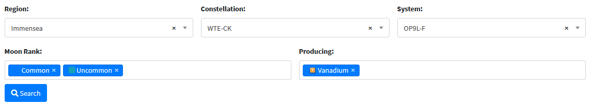
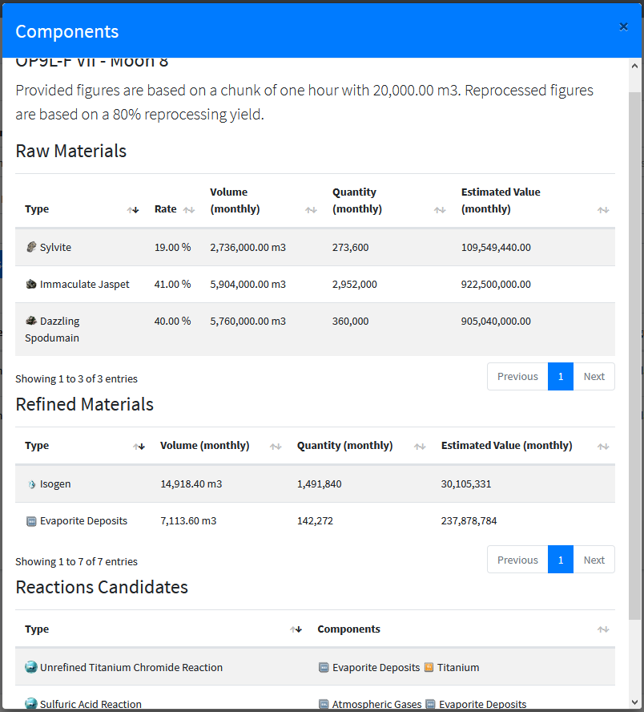

# Moons Reporter

Introduced in SeAT 4.0, a new tool is available to assist you in your moon management task by leveraging your intelligence desk.
Like your old google/excel sheet, it will gather all your intel related to moon probing.
It provides a centralized and convenient way to store reports and search through them.

Of course, like other modules, you are able to restrict its usage using ACL by choosing who can view it and/or import reports.


## Importing reports


Seeding an intelligence database is usually a really long task. The Moons Reporter simplifies the process as much as possible by accepting your raw moon report collected by the in-game moon probing interface.

Here is the process which need to be follow in order to be able to import a new moon report :

  - fire your probe in-game and wait for the report to land
  - use the "Copy to Clipboard" button from your "Moon Probe and Analysis" window 
  - go on the Moons Report and hit the "Import" button located on top right (1)
  - paste copied content in the opening modal and hit "Post report"

That's all, SeAT will take care of your report and apply change accordingly.

!!! tip
    You can paste multiple moon report in once - so, to gain time and save clicks, you will probably prefer to scans all moons in a system before importing them into SeAT.

!!! info
    When importing a report targeting an already imported moon report, existing data will be erased and replaced by the new report.

!!! caution
    In case you have to import data from an existing sheet, you will have to generate report based on your information.
    Please put an eye into [migrate section](#migrating) from this documentation.

## Advanced Search



The Moons Reporter is shipped with an advanced search panel (2) which allow you to search moons by different criteria :

  - region
  - constellation
  - system
  - rank
  - produces

Region, Constellation and System filters will be driven together depending on what you're doing - making your search easier.

You are able to provide multiple rank into the rank filter (like ubiquitous, common, uncommon, rare and exceptional).
When you are using this filter, only moon which contain all criteria will be displayed.
For example, if you are searching for a moon which contain common and uncommon materials, simply select both criteria.

Like rank filter, the produces filter is allowing you to track for moons containing multiple materials.
As an example, you can search for moons producing both Vanadium and Cobalt.

To make a search, once you put your criteria, use the search button.

## Moon Information

### Moon Metadata

Main pane (3) is showing you the list of all probed moons. You'll get quick intel on them with indicator and sovereignty columns.
However, in case you want more information regarding a moon, you can click on the eye button which will show you the moon card.

Displayed sovereignty depends on public in-game collected intel regarding systems. Those data are updated once a day - after down-time.

### Moon Card



You are able to access details regarding a moon, simple by clicking on the eye button, located in the action column.
Moon card will give you some valuable information like contained raw materials, reprocessed materials and reactions candidates.

The Moons Reporter is not only showing you types but also figures like volume, quantity and estimated value.
All of them are computed based on a regular chunk of 20,000.00m3 - and upgraded to 30 days for convenience.
The base reprocessing yield is 80% - however, you are able to determine which yield must be used into your user profile.

## Moon Stats

Some stats are provide in Moons Reporter footer (4). They are showing you the number of raw materials, per rank, from all your scanned moons.
Those stats are list in the same order as the indicator column :

  - Gaz or Ubiquitous asteroids
  - R8 or Common asteroids
  - R16 or Uncommon asteroids
  - R32 or Rare asteroids
  - R64 or Exceptional asteroids
  - Ore (standard asteroids - like Scordite, Spodumain, etc...)

## Migrating

Moons Reporter can only accept reports using Eve Online raw format. As a result, you will probably not be able to import data from an existing sheet without process.
Luckily, the used format is quite simple to recover from collected data. You will find bellow a sample :

```
Moon	Moon Product	Quantity	Ore TypeID	SolarSystemID	PlanetID	MoonID

OP9L-F II - Moon 1
	Glossy Scordite	0.300030559301	46687	30002173	40138526	40138527
	Immaculate Jaspet	0.328855156898	46682	30002173	40138526	40138527
	Pellucid Crokite	0.287893354893	46677	30002173	40138526	40138527
	Sylvite	0.083220936358	45491	30002173	40138526	40138527
```

Keep the two first lines as it, it's the report header.
You will then have same format for every moon you need to put inside the report :

  - The full qualified moon name
  - One line per moon compound - indented by a tabulation

Moon compound line are built using :

  - Type name
  - Rate (number between 0 and 1, using `.` a decimal separator - without thousands separator)
  - Type identifier (number without either decimal or thousands separator)
  - Solar system identifier (number without either decimal or thousands separator)
  - Planet identifier (number without either decimal or thousands separator)
  - Moon identifier (number without either decimal or thousands separator)

If you need either the type name or the type identifier, you can use the amazing work from Fuzzy Steve :
- [Types information](https://www.fuzzwork.co.uk/dump/latest/invTypes.csv.bz2)
- [Celestial information](https://www.fuzzwork.co.uk/dump/latest/mapDenormalize.csv.bz2)

!!! caution
    Take care of separators. Report is using tabulations between column and not simple spaces.
    Also, each line must end with an end line and a carriage return character (CRLF - or Windows carriage return format)
